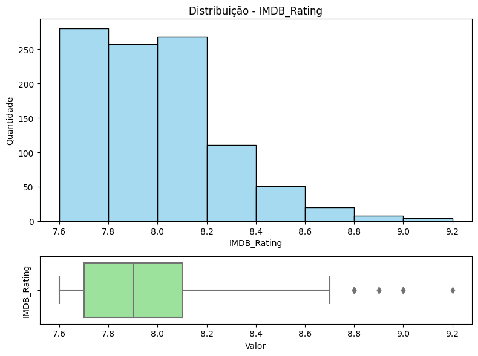
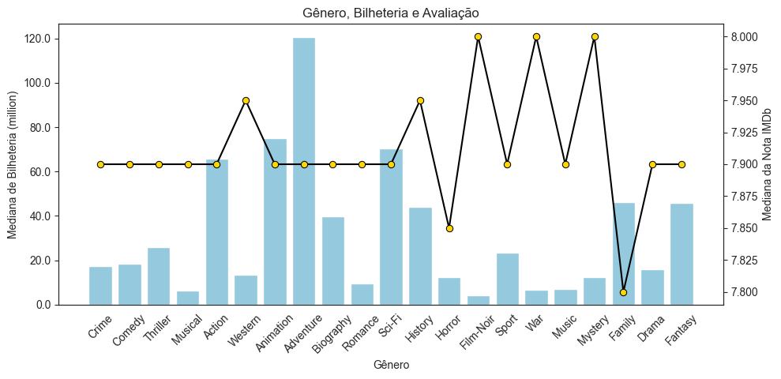
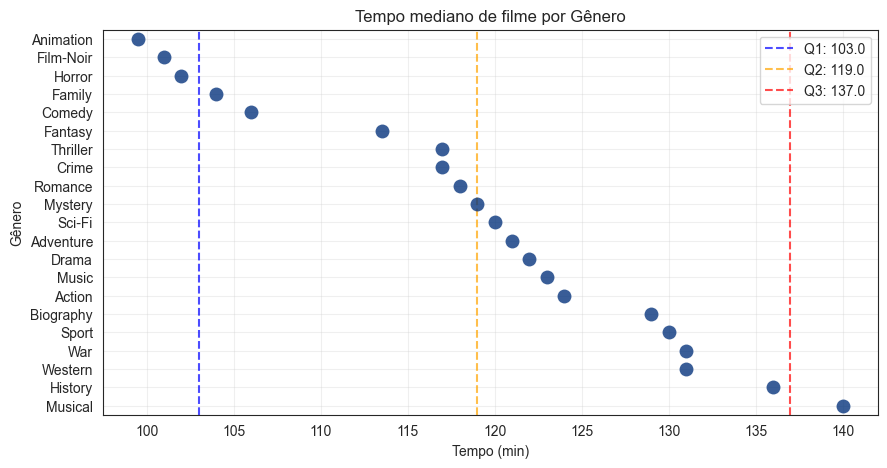
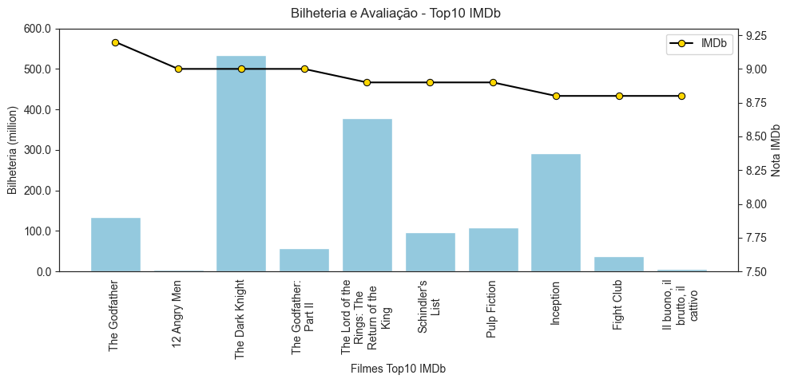
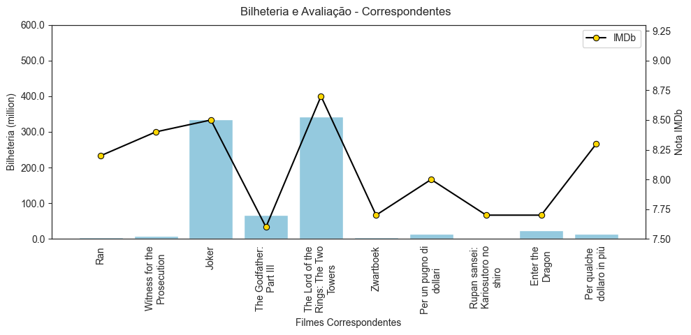
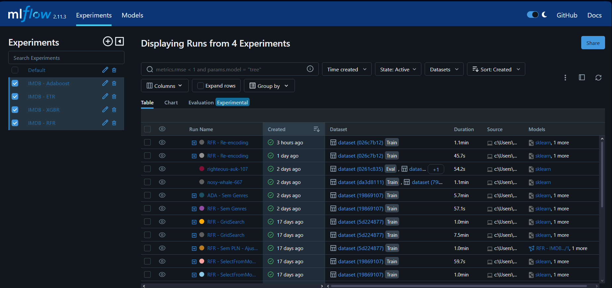

# 📄 IMDB Prediction

O IMDb (Internet Movie Database) é um portal online responsável por uma base de dados de informações sobre cinema, TV, jogos e música, administrada pela Amazon. Nele, estão cadastradas obras dessas mídias, com dados relacionados a equipe envolvida na criação (elenco, diretores, produtores), datas de lançamento, faturamento e recepção das mídias através de avaliações enviadas por usuários cadastrados. <br><br>
Vamos verificar o comportamento da distribuição dos dados em suas características, a fim de avaliar se existe a possibilidade de estimar as notas dadas pelos usuários a partir dos atributos existentes nas obras cadastradas no database.<br><br>
Este projeto foi desenvolvido como desafio do programa Lighthouse da Indicium.

## ⚙️ Pré-requisitos

Para rodar este projeto, você precisará ter o Python instalado. Recomenda-se usar um ambiente virtual (como `venv` ou `conda`).

## 🛠️ Configuração do Ambiente

1.  **Clone o repositório:**
    ```bash
    git clone https://github.com/glauciapamponet/imdb-prediction.git
    cd imdb-prediction
    ```

2.  **Crie um Ambiente Virtual (Recomendado):**
    ```bash
    python -m venv venv
    ```

3.  **Ative o Ambiente Virtual:**
    * **Windows:**
        ```bash
        .\venv\Scripts\activate
        ```
    * **macOS/Linux:**
        ```bash
        source venv/bin/activate
        ```

4.  **Instale as dependências:**
    Todas as bibliotecas necessárias estão listadas no arquivo `requirements.txt`.
    ```bash
    pip install -r requirements.txt
    ```

## 📊 Análise Exploratória de Dados (EDA)

A amostra contém 999 registros de obras cadastradas no portal. Apresenta variáveis numéricas, categóricas e textuais. <br>

| Coluna | Contagem Não-Nula | Tipo de Dado (Dtype) |
| :--- | :--- | :--- |
| **Unnamed: 0** | 999 | `int64` |
| **Series_Title** | 999 | `object` |
| **Released_Year** | 999 | `object` |
| **Certificate** | 898 | `object` |
| **Runtime** | 999 | `object` |
| **Genre** | 999 | `object` |
| **IMDB_Rating** | 999 | `float64` |
| **Overview** | 999 | `object` |
| **Meta_score** | 842 | `float64` |
| **Director** | 999 | `object` |
| **Star1** | 999 | `object` |
| **Star2** | 999 | `object` |
| **Star3** | 999 | `object` |
| **Star4** | 999 | `object` |
| **No_of_Votes** | 999 | `int64` |
| **Gross** | 830 | `object` |

<br>
A variável que buscamos estimar é a de média de nota das avaliações dentro do portal (IMDB_Rating). Vamos então observar sua distribuição dentro da amostra e o comportamento de dispersão quando relacionados a outras variáveis.<br><br>



Pela distribuição, podemos ver que a amostra está direcionada a seleção de obras com avaliação entre 7,6 e 9,2, intervalo considerado popularmente como mediano-bom a bom. Há poucos outliers no conjunto.

### Análise de Público Multivariada <br>
A recepção de público pode ser medida dentro da amostra em contextos variados, seja em crítica especializada, nota do público ou em faturamento. Para os grandes estúdios, essa última representa o máximo de importância dentro do lançamento de um projeto, pois confere a possibilidade de retorno do investimento. Sendo assim, considerando essa importância de retorno, vamos avaliar a amostra para descobrir **os fatores relacionados à alta expectativa de faturamento de um filme**.<br><br>

**1 - O que indicar para uma pessoa que não conhecemos?**

Atribuindo titulo de popularidade à bilheteria (Gross) de um filme, vamos começar observando entre os generos disponíveis, onde podemos encontrar os maiorers e menores níveis de popularidade.



Adotando um olhar comparativo, podemos notar que os picos de nota mediana não correspondem a faturamentos exorbitantes, como é o caso de War, Film-Noir e Mystery. Considerando o recorte de classificação em nota da amostra e sua amplitude, olhando o contrário da baixa popularidade, temos Adventure, Animation e Sci-Fi com alto faturamento e avaliação mediana, quando generalizada.

**2 - O que levaria alguém a desistir de ver um filme que é considerado bom por quem viu?**

Nesse contexto de comportamento comum na escolha de um filme, vamos considerar fatores de conforto para levantarmos hipóteses.<br>
A primeira delas é o **tempo de reprodução**. <br><br>


O segundo possível fator de interesse pode ser **a sinopse**.<br>

Considerando que sinopses similares tendem a atrair públicos similares, será que conseguimos encontrar semelhança nos enredos mais similares aos filmes mais populares da amostra?<br>




Assim, considerando o grau de popularidade tomando como métrica a bilheteria, **o que recomendar a quem não se sabe nada?**

- Sinopse e Gênero focados em Aventura
- Com menos de 130min de duração
- Lançamento a partir dos anos 2000

O notebook `EDA.ipynb` (localizado em `Notebooks/`) contém a análise detalhada e visualizações dos dados utilizados para treinar o modelo.

## ⚙ Modelagem Preditiva

Apoiando a escolha para o melhor modelo a treinar, foi utilizada a ferramenta de MLOps MLflow. Trata-se de uma plataforma open-source que gerencia o ciclo de vida do Machine Learning, sendo o MLflow Tracking seu componente crucial para a experimentação. Ele foi utilizado com o **GridSearch** para trazer organização e reprodutibilidade, sendo configurado para registrar cada modelo testado pelo GridSearch, salvando automaticamente os parâmetros daquela combinação (hiperparametros de cada modelo), as métricas de desempenho **(MSE, MAE e R2)** e o próprio modelo treinado, permitindo compararmos e visualizarmos facilmente o melhor resultado final na interface gráfica do MLflow.<br>



## 🏃 Como Rodar o Modelo

O modelo treinado e serializado (`model.pkl`) está localizado no diretório `model/`. Para rodar o modelo principal (seja para inferência ou novo treinamento), utilize o notebook principal.

1.  **Inicie o Jupyter Notebook (se ainda não estiver rodando):**
    ```bash
    jupyter notebook
    ```
2.  No seu navegador, navegue até a pasta `Notebooks` e abra o arquivo **`ML.ipynb`**.
3.  Execute as células do notebook a partir da seção `Teste da Versão Selecionada`. Este arquivo deve conter o carregamento e a execução do modelo.
